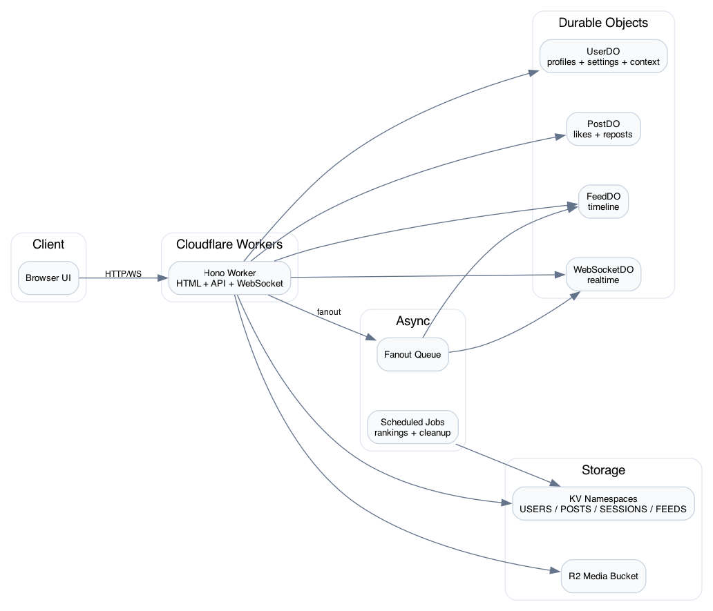

# The Wire

<<<<<<< HEAD
A globally distributed social network built on Cloudflare's edge infrastructure. Share notes in 280 characters with sub-50ms latency worldwide.

## Features

- **Edge-Native Architecture**: Runs on Cloudflare Workers across 300+ global locations
- **Real-Time Updates**: WebSocket-based live feed updates
- **Multi-Theme UI**: 6 beautiful themes including pixel-perfect Twitter styling
- **Strong Consistency**: Durable Objects ensure data consistency across the globe
- **Infinite Scale**: Auto-scales to handle millions of users with zero configuration

## Tech Stack

- **Runtime**: Cloudflare Workers (V8 isolates)
- **Framework**: Hono (lightweight, fast, edge-optimized)
- **Storage**: Cloudflare KV (global key-value), R2 (object storage), Durable Objects (stateful coordination)
- **Queues**: Cloudflare Queues for async fan-out processing
- **Frontend**: Vanilla JavaScript with shadcn/ui-inspired theming, Lucide icons

## Architecture

See the [Architecture Diagram](#architecture-diagram) below for a visual overview of how all components connect.

### Core Services

1. **Cloudflare Workers** - Main application logic running at the edge
2. **Durable Objects** - Four types providing strong consistency:
   - `UserDO` - User profiles, follows, blocks
   - `PostDO` - Individual posts, likes, engagement
   - `FeedDO` - User timelines and feed ranking
   - `WebSocketDO` - Real-time connection management
3. **KV Namespaces** - Global caching layer:
   - `USERS_KV` - User profiles and auth data
   - `POSTS_KV` - Post metadata cache
   - `SESSIONS_KV` - Active sessions
   - `FEEDS_KV` - Feed rankings cache
4. **R2 Storage** - Media files (avatars, banners, images)
5. **Queues** - Async processing:
   - `FANOUT_QUEUE` - Distributing posts to followers' feeds

## Local Development

### Prerequisites

- Node.js 18+
- npm or pnpm
- Cloudflare account (for deployment)

### Setup

1. Clone the repository:
```bash
git clone https://github.com/chrischabot/the-wire.git
cd the-wire
```

2. Install dependencies:
```bash
npm install
```

3. Configure environment variables:
```bash
# Create .dev.vars file for local secrets
echo "JWT_SECRET=your-secret-key-min-32-chars" > .dev.vars
```

4. Start development server:
```bash
npm run dev
```

The app will be available at http://localhost:8080

### Available Scripts

- `npm run dev` - Start development server with hot reload
- `npm run deploy` - Deploy to Cloudflare
- `npm run test` - Run unit tests
- `npm run test:integration` - Run integration tests
- `npm run typecheck` - TypeScript type checking

## Production Deployment

### Step 1: Create Cloudflare Resources

Before deploying, you need to provision the required Cloudflare resources.

#### 1.1 Create KV Namespaces

```bash
# Create production KV namespaces
wrangler kv:namespace create "USERS_KV"
wrangler kv:namespace create "POSTS_KV"
wrangler kv:namespace create "SESSIONS_KV"
wrangler kv:namespace create "FEEDS_KV"
```

Save the namespace IDs returned by these commands.

#### 1.2 Create R2 Bucket

```bash
# Create R2 bucket for media storage
wrangler r2 bucket create the-wire-media
```

#### 1.3 Create Queue

```bash
# Create queue for async processing
wrangler queues create fanout-queue
```

### Step 2: Configure wrangler.toml

Update `wrangler.toml` with the actual resource IDs from Step 1:

```toml
[[kv_namespaces]]
binding = "USERS_KV"
id = "your-actual-users-kv-id"  # Replace with ID from step 1.1

[[kv_namespaces]]
binding = "POSTS_KV"
id = "your-actual-posts-kv-id"  # Replace with ID from step 1.1

# ... repeat for SESSIONS_KV and FEEDS_KV

[[r2_buckets]]
binding = "MEDIA_BUCKET"
bucket_name = "the-wire-media"  # From step 1.2

[[queues.producers]]
binding = "FANOUT_QUEUE"
queue = "fanout-queue"  # From step 1.3
```

### Step 3: Set Production Secrets

```bash
# Set JWT secret (use a cryptographically secure random string, min 32 characters)
wrangler secret put JWT_SECRET
# When prompted, enter a secure random string like:
# openssl rand -base64 32

# Optional: Set other production secrets
wrangler secret put SENTRY_DSN  # If using error tracking
```

### Step 4: Deploy

```bash
# Deploy to production
npm run deploy

# Or with wrangler directly
wrangler deploy
```

The deployment will:
1. Bundle your TypeScript code
2. Upload to Cloudflare's global network
3. Configure all bindings (KV, R2, DOs, Queues)
4. Make your app available at `<your-worker-name>.workers.dev`

### Step 5: Custom Domain (Optional)

```bash
# Add custom domain via Cloudflare dashboard or CLI
wrangler domains add the-wire.com
```

## Geographic Distribution & Scalability

### How It Works

**The Wire is designed to scale globally with zero configuration:**

1. **Edge Distribution**
   - Cloudflare Workers run in 300+ cities worldwide
   - User requests route to nearest data center (<50ms latency)
   - Static assets (HTML, CSS, JS) cached at edge

2. **Data Replication**
   - **KV**: Eventually consistent, globally replicated
     - Writes go to nearest data center
     - Propagate to all locations within 60 seconds
     - Reads served from local cache (sub-millisecond)
   - **Durable Objects**: Strongly consistent, single-location
     - Each DO instance runs in one location
     - Requests automatically routed to the DO's home location
     - Provides transactional guarantees for critical data

3. **Smart Data Placement**
   - **Hot data** (active users, recent posts): Cached in KV at edge
   - **Authoritative state** (follows, likes): Managed by Durable Objects
   - **Large media**: Stored in R2 with CDN delivery

4. **Async Processing**
   - New posts trigger queue messages
   - Queue consumers fan out posts to followers' feeds
   - Decouples write-heavy operations from user requests

### Scalability Characteristics

| Metric | Capacity | Notes |
|--------|----------|-------|
| **Concurrent Users** | Unlimited | Auto-scales with traffic |
| **Requests/Second** | 10M+ | Per Cloudflare limits |
| **Geographic Latency** | <50ms | P50 to nearest PoP |
| **Storage** | Unlimited | KV + R2 scale infinitely |
| **WebSocket Connections** | 1M+ per DO | Distributed across DOs |

### Cost Efficiency

Cloudflare's pricing model makes The Wire extremely cost-efficient:

- **Free Tier**: 100K requests/day, adequate for small communities
- **Paid Plan** (\$5/month): 10M requests/month
- **Enterprise**: Custom pricing for massive scale

## Architecture Diagram

The diagram below shows how all Cloudflare services interconnect to deliver The Wire's functionality.



*(Diagram generated below)*

## UI Themes

The Wire includes 6 professionally designed themes:

1. **Twitter** - Pixel-perfect Twitter styling (pure black, Twitter blue)
2. **Vega** - Classic shadcn/ui slate theme
3. **Nova** - Compact, efficient layouts
4. **Maia** - Soft, rounded, generous spacing
5. **Lyra** - Boxy, sharp, monospace fonts
6. **Mira** - Ultra dense, maximum information

Switch themes in **Settings → Appearance**.

## API Documentation

### Authentication

All authenticated endpoints require a `Bearer` token:

```bash
curl -H "Authorization: Bearer YOUR_JWT_TOKEN" \
  https://your-worker.workers.dev/api/auth/me
```

### Key Endpoints

- `POST /api/auth/signup` - Create account
- `POST /api/auth/login` - Login
- `GET /api/auth/me` - Get current user
- `POST /api/posts` - Create post
- `GET /api/feed/home` - Get personalized feed
- `GET /api/feed/global` - Get global explore feed
- `GET /api/users/:handle` - Get user profile
- `POST /api/users/:handle/follow` - Follow user
- `WS /api/ws?token=JWT` - WebSocket for real-time updates

See inline code documentation for complete API reference.

## Feed Algorithm

The Wire uses a sophisticated feed algorithm:

1. **Round-Robin Merge**: 2 posts from followed users + 1 friends-of-friends post
2. **FoF Ranking**: Hacker News-style scoring based on engagement and time decay
3. **Filtering**: Respects blocked users and muted keywords
4. **Real-Time Updates**: New posts appear instantly via WebSocket
=======
A social network that runs entirely at the edge.


## The Pitch

Every request to The Wire travels no further than the nearest Cloudflare data center. Posts propagate globally in milliseconds. User state lives in Durable Objects that follow users around the world. Media streams from R2 buckets positioned at the edge. The entire application, from authentication to feed ranking, executes within 50ms of your users.

This is what becomes possible when you build a social network on Cloudflare's edge infrastructure rather than in centralized data centers.

## Why This Exists

The Wire serves as a reference implementation for building stateful, globally distributed applications on Cloudflare Workers. It demonstrates that the edge can handle complex social networking features: personalized feeds, real-time notifications, media uploads, follower graphs, and content moderation. The patterns here apply to any application where latency matters and users are scattered across the globe.

## What It Does

The Wire replicates the core Twitter experience:

**Identity and Social Graph**
- Email and password authentication with JWT tokens validated at the edge
- User profiles with avatars, bios, and follower counts
- Follow, unfollow, and block relationships stored in per-user Durable Objects

**Content**
- 280-character posts with support for images and videos
- Replies, likes, reposts, and quote posts
- Snowflake IDs for chronologically sortable, globally unique identifiers

**Feed**
- Personalized home timeline built from posts by accounts you follow
- Friends-of-friends discovery using a Hacker News-style ranking algorithm
- Round-robin merge: two posts from your follows, one from the wider network
- Cursor-based pagination with blocked user and muted word filtering

**Real-time**
- WebSocket connections for live notification delivery
- Instant updates when someone likes, reposts, or mentions you

**Moderation**
- Admin roles with the ability to ban users and take down posts
- Per-user block lists and muted word filters

## Architecture

The Wire distributes state and compute across Cloudflare's primitives:

| Component | Role |
|-----------|------|
| **Workers** | HTTP routing via Hono, middleware chain, business logic |
| **Durable Objects** | UserDO for profiles and social graph, PostDO for interaction counts, FeedDO for personalized timelines, WebSocketDO for real-time connections |
| **KV** | Authentication cache, post metadata, session storage, feed rankings |
| **R2** | Image and video storage with magic byte validation |
| **Queues** | Fanout queue for distributing posts to follower feeds |
| **Cron Triggers** | Scheduled jobs for ranking updates (15 min), feed cleanup (hourly), and KV compaction (daily) |

The Durable Object model is central to how The Wire achieves consistency at scale. Each user has their own UserDO instance that acts as the single source of truth for their profile, settings, and social connections. When you follow someone, both your UserDO and their UserDO update transactionally. When you post, the message fans out through a queue to the FeedDO instances of each follower. This architecture means that read operations almost always hit local state while writes coordinate only where necessary.

## Running Locally

Prerequisites: Node.js 18+, a Cloudflare account

```bash
# Install dependencies
npm install

# Set up local environment
cp .dev.vars.example .dev.vars
# Edit .dev.vars and add: JWT_SECRET=your-secret-here

# Start development server
npm run dev
```

The application runs at `http://localhost:8080`. Create an account and start posting.

## Deploying to Production

```bash
# Create KV namespaces
wrangler kv:namespace create USERS_KV
wrangler kv:namespace create POSTS_KV
wrangler kv:namespace create SESSIONS_KV
wrangler kv:namespace create FEEDS_KV

# Create R2 bucket
wrangler r2 bucket create the-wire-media

# Create queue
wrangler queues create fanout-queue

# Set secrets
wrangler secret put JWT_SECRET

# Deploy
npm run deploy
```

Update `wrangler.toml` with the namespace and bucket IDs from the creation commands.

## Configuration

Environment variables in `wrangler.toml`:

| Variable | Default | Description |
|----------|---------|-------------|
| `JWT_EXPIRY_HOURS` | 24 | Token lifetime |
| `MAX_NOTE_LENGTH` | 280 | Character limit for posts |
| `FEED_PAGE_SIZE` | 20 | Posts per page |
| `INITIAL_ADMIN_HANDLE` | - | Handle to grant admin privileges on first login |

## Security Model

The Wire implements layered defenses appropriate for a production social network:

- **Rate limiting**: KV-based distributed rate limiter with per-endpoint limits (5 login attempts per minute, 30 posts per hour, 20 media uploads per hour)
- **CSRF protection**: Origin header validation on state-changing requests
- **Account lockout**: Progressive delays after failed login attempts
- **File validation**: Magic byte verification on media uploads, not just MIME type checking
- **Input sanitization**: XSS prevention and URL scheme validation

JWT tokens are stateless, which means compromised tokens remain valid until expiration. This tradeoff favors edge performance over immediate revocation capability. For applications requiring instant token invalidation, add a blocklist in KV.
>>>>>>> 6578d01 (Tweaks, and bugfixes)

## Testing

```bash
<<<<<<< HEAD
# Run all tests
npm test

# Run specific test suites
npm run test:integration
npm run test:scale

# Run with coverage
npm run test:coverage
```

## Production Monitoring

### Cloudflare Dashboard

Monitor your deployment via the Cloudflare dashboard:

- **Analytics**: Request volume, latency, errors
- **Logs**: Real-time and historical logs (requires Workers Logpush)
- **Durable Objects**: Per-object metrics
- **KV**: Storage usage and operation counts

### Recommended Observability

1. **Error Tracking**: Sentry or similar
2. **Performance Monitoring**: Cloudflare Web Analytics
3. **Custom Metrics**: Use Workers Analytics Engine

## Security

- **Authentication**: JWT-based with secure password hashing
- **CSRF Protection**: Automatic token validation
- **Rate Limiting**: Per-IP and per-user limits
- **Input Validation**: All user input sanitized
- **Content Moderation**: Ban/mute functionality

## Performance

- **Cold Start**: <5ms (V8 isolates, not containers)
- **Global Latency**: P50 <50ms, P99 <200ms
- **Feed Loading**: <100ms for 20 posts
- **Real-Time**: WebSocket messages delivered in <50ms

## Contributing

1. Fork the repository
2. Create a feature branch
3. Make your changes
4. Run tests: `npm test`
5. Submit a pull request

## License

MIT License - see LICENSE file for details

## Support

- **Issues**: https://github.com/chrischabot/the-wire/issues
- **Discussions**: https://github.com/chrischabot/the-wire/discussions
- **Documentation**: See inline code comments

## Acknowledgments

- Inspired by Twitter/X's UI design
- Built with [Hono](https://hono.dev/)
- Icons from [Lucide](https://lucide.dev/)
- Theming inspired by [shadcn/ui](https://ui.shadcn.com/)
=======
# Unit tests
npm test

# Integration tests
npm run test:integration

# Type checking
npm run typecheck
```

The test suite uses Vitest with Cloudflare's worker pool for realistic edge execution.

## Project Structure

```
src/
├── index.ts              # Worker entry, routes, middleware
├── durable-objects/      # UserDO, PostDO, FeedDO, WebSocketDO
├── handlers/             # Route handlers by domain
├── middleware/           # Rate limiting, CSRF
├── services/             # Notifications, snowflake IDs
├── types/                # TypeScript interfaces
└── utils/                # Validation, JWT, crypto
public/
├── home.html             # Main application shell
├── css/                  # Styles with theme variants
└── js/                   # Client-side logic
```

## Constraints and Tradeoffs

**N+1 queries**: Fetching a feed currently requires one KV read per post. At scale, this should migrate to secondary indices or denormalized feed entries. The current approach works well for thousands of users but will need optimization for millions.

**Eventually consistent**: KV propagates globally within seconds, not milliseconds. Users in different regions may briefly see stale data after writes. This is acceptable for social content but inappropriate for financial transactions.

**No email delivery**: Password reset tokens work, but The Wire does not send emails. Integrate with a transactional email service for production use.

**Single-region Durable Objects**: Each Durable Object instance lives in one location. Users far from their DO's region experience slightly higher latency on write operations. Cloudflare's smart placement helps, but this remains a consideration for globally distributed teams.

## What This Proves

Social networking at the edge is not a theoretical exercise. The Wire demonstrates that:

1. Complex stateful applications can run entirely on edge infrastructure
2. Durable Objects provide the consistency guarantees that social features require
3. Sub-50ms response times are achievable globally without regional deployments
4. The operational model simplifies dramatically when there are no servers to manage

The techniques here apply beyond social networks. Any application that benefits from low latency and global distribution can adopt these patterns: collaborative editing, real-time gaming, IoT command and control, or financial trading systems with global reach.

## License

MIT License. See [LICENSE](LICENSE) for details.

---

Built by [Chris Chabot](https://github.com/chrischabot)
>>>>>>> 6578d01 (Tweaks, and bugfixes)
