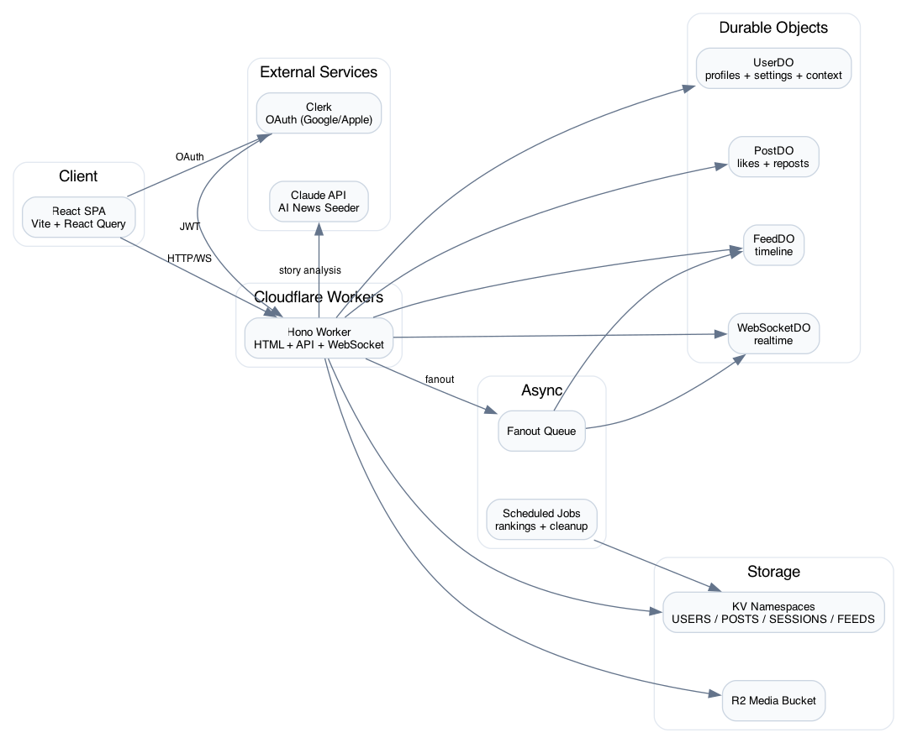

# The Wire - Architecture Documentation

A Twitter-like social network built entirely on Cloudflare's edge infrastructure.



Diagram source: `docs/architecture.dot` (Graphviz) and `docs/architecture.mmd` (Mermaid).

## Overview

The Wire is a globally distributed social network that runs on Cloudflare Workers with sub-50ms latency worldwide. It uses Durable Objects for strong consistency, KV for caching, R2 for media storage, and Queues for async fan-out.

## System Architecture

```
                                    ┌─────────────────────────────────────────────────────────────┐
                                    │                    CLOUDFLARE EDGE                          │
┌──────────┐                        │  ┌─────────────────────────────────────────────────────┐   │
│  Client  │◄──────HTTP/WS─────────►│  │                  WORKERS (Hono.js)                  │   │
│ Browser  │                        │  │  ┌─────────┐ ┌─────────┐ ┌─────────┐ ┌──────────┐  │   │
└──────────┘                        │  │  │  Auth   │ │  Posts  │ │  Feed   │ │  Media   │  │   │
                                    │  │  │ Handler │ │ Handler │ │ Handler │ │ Handler  │  │   │
                                    │  │  └────┬────┘ └────┬────┘ └────┬────┘ └────┬─────┘  │   │
                                    │  │       │          │          │           │         │   │
                                    │  │  ┌────▼──────────▼──────────▼───────────▼─────┐   │   │
                                    │  │  │              MIDDLEWARE STACK              │   │   │
                                    │  │  │  CORS → Rate Limit → CSRF → JWT Auth      │   │   │
                                    │  │  └────────────────────────────────────────────┘   │   │
                                    │  └──────────────────────┬────────────────────────────┘   │
                                    │                         │                                │
                                    │  ┌──────────────────────▼────────────────────────────┐   │
                                    │  │              DURABLE OBJECTS (State)              │   │
                                    │  │  ┌────────┐  ┌────────┐  ┌───────┐  ┌──────────┐  │   │
                                    │  │  │ UserDO │  │ PostDO │  │FeedDO │  │WebSocketDO│ │   │
                                    │  │  └────────┘  └────────┘  └───────┘  └──────────┘  │   │
                                    │  └───────────────────────────────────────────────────┘   │
                                    │                                                          │
                                    │  ┌────────────────────────────────────────────────────┐  │
                                    │  │                    STORAGE                         │  │
                                    │  │  ┌──────────┐  ┌──────────┐  ┌──────────┐         │  │
                                    │  │  │ USERS_KV │  │ POSTS_KV │  │SESSIONS_KV│         │  │
                                    │  │  └──────────┘  └──────────┘  └──────────┘         │  │
                                    │  │  ┌──────────┐  ┌──────────────────────────┐       │  │
                                    │  │  │ FEEDS_KV │  │ R2: MEDIA_BUCKET         │       │  │
                                    │  │  └──────────┘  └──────────────────────────┘       │  │
                                    │  └────────────────────────────────────────────────────┘  │
                                    │                                                          │
                                    │  ┌────────────────────────────────────────────────────┐  │
                                    │  │              ASYNC PROCESSING                      │  │
                                    │  │  ┌─────────────────┐  ┌─────────────────────────┐  │  │
                                    │  │  │  FANOUT_QUEUE   │  │   CRON TRIGGERS         │  │  │
                                    │  │  │  (post fanout)  │  │   (rankings, cleanup)   │  │  │
                                    │  │  └─────────────────┘  └─────────────────────────┘  │  │
                                    │  └────────────────────────────────────────────────────┘  │
                                    └─────────────────────────────────────────────────────────────┘
```

## Cloudflare Services

### 1. Workers (Edge Computing)

**Entry Point:** `src/index.ts`
**Framework:** Hono.js

The main Worker handles all HTTP requests at 300+ edge locations:

- Server-rendered HTML pages
- API routes (`/api/*`)
- WebSocket upgrades (`/ws`)
- Media serving (`/media/*`)
- Static assets (`/css/*`, `/js/*`)

Home feed requests are optimized to use a small, batched set of subrequests:
`UserDO/context` for blocked + following + settings, `FeedDO/feed-with-posts` for
followed content, and cached `FEEDS_KV` rankings for explore blending.

### 2. Durable Objects (Stateful Actors)

Four DO classes provide distributed state management with strong consistency:

| Durable Object  | ID Pattern | Purpose                         | Key Methods                                            |
| --------------- | ---------- | ------------------------------- | ------------------------------------------------------ |
| **UserDO**      | `{userId}` | Profile, social graph, settings | `getProfile()`, `follow()`, `block()`, `context()`     |
| **PostDO**      | `{postId}` | Post state, interactions        | `like()`, `unlike()`, `repost()`, `delete()`           |
| **FeedDO**      | `{userId}` | Personalized timeline           | `addEntry()`, `getFeed()`, `feed-with-posts()`         |
| **WebSocketDO** | `{userId}` | Real-time connections           | `connect()`, `broadcast()`, `broadcast-notification()` |

### 3. KV Namespaces (Global Cache)

| Namespace       | Key Patterns                                                                    | Purpose                                   | TTL          |
| --------------- | ------------------------------------------------------------------------------- | ----------------------------------------- | ------------ |
| **USERS_KV**    | `user:{id}`, `email:{email}`, `handle:{handle}`, `profile:{handle}`             | Auth, user lookups, profile cache         | Profile: 1hr |
| **POSTS_KV**    | `post:{id}`, `user-posts:{userId}`, `search:word:{word}`                        | Post metadata, author index, search index | Infinite     |
| **SESSIONS_KV** | `notification_list:{id}`, `notifications:{id}:{nid}`, `rl:*`, `ban-status:{id}` | Notifications, rate limits, ban cache     | Varies       |
| **FEEDS_KV**    | `fof:ranked`, `explore:ranked`                                                  | Pre-computed rankings                     | 15 min       |

### 4. R2 Bucket (Object Storage)

**Bucket:** `the-wire-media`

Stores user-uploaded media with magic byte validation:

- Avatars and banners
- Post images (max 5MB): JPEG, PNG, GIF, WebP
- Post videos (max 50MB): MP4, WebM

### 5. Queue (Async Processing)

**Queue:** `fanout-queue`

Fan-out post distribution to followers:

- **Producer:** Post creation in `src/handlers/posts.ts`
- **Consumer:** Batch processor (100 msgs, 30s timeout)
- **Messages:** `new_post`, `delete_post`

### 6. Scheduled Tasks (Cron)

| Schedule       | Handler                   | Purpose                                |
| -------------- | ------------------------- | -------------------------------------- |
| `*/15 * * * *` | `updateFoFRankings()`     | Compute friends-of-friends rankings    |
| `*/15 * * * *` | `updateExploreRankings()` | Compute explore page with HN algorithm |
| `0 * * * *`    | `cleanupFeedEntries()`    | Remove feed entries older than 7 days  |
| `0 0 * * *`    | `compactKVStorage()`      | Remove deleted posts (30+ days)        |

### 7. External Services

#### Claude API (AI News Seeder)

The AI News Seeder system generates realistic, engaging content from real-world AI/ML news:

| Component                  | File                                     | Purpose                                                                           |
| -------------------------- | ---------------------------------------- | --------------------------------------------------------------------------------- |
| **News Aggregator**        | `src/services/news-aggregator.ts`        | Fetches stories from RSS feeds (ArXiv, TechCrunch) and Hacker News                |
| **Story Processor**        | `src/services/story-processor.ts`        | Claude analyzes stories for relevance, generates talking points, assigns personas |
| **Conversation Generator** | `src/services/conversation-generator.ts` | Creates posts and reply threads from 20 AI expert personas                        |
| **API Handler**            | `src/handlers/news-seed.ts`              | Admin endpoints to trigger seeding, manage personas                               |

**Personas**: 20 distinct AI/ML expert profiles with unique perspectives (researchers, engineers, ethicists, startup founders, etc.). Each persona has a defined voice, focus areas, and engagement patterns.

**Flow**:

```
RSS/HN → News Aggregator → Story Processor (Claude) → Conversation Generator → Posts + Threads
```

#### Clerk (OAuth Authentication)

Clerk provides OAuth authentication for Google and Apple sign-in:

| Component      | File                           | Purpose                                         |
| -------------- | ------------------------------ | ----------------------------------------------- |
| **Handler**    | `src/handlers/clerk-auth.ts`   | Session check, onboarding flow, account linking |
| **Middleware** | `src/middleware/clerk-auth.ts` | JWT validation, user context injection          |

**Auth Flow**:

1. User clicks "Sign in with Google/Apple" → redirected to Clerk
2. Clerk validates OAuth and returns JWT
3. `requireClerkAuth` middleware validates JWT, extracts `clerkUserId`
4. If new user: redirect to handle selection (onboarding)
5. If existing: link Clerk account to internal user, return session

**Environment Variables**: `CLERK_PUBLISHABLE_KEY`, `CLERK_SECRET_KEY`

## Project Structure

```
src/
├── index.ts                    # Worker entry, route mounting, queue consumer
├── constants.ts                # LIMITS, CACHE_TTL, SCORING, BATCH_SIZE, RETENTION
├── styles.ts                   # Inline CSS for SSR pages
├── client-js.ts                # Client-side JavaScript for SSR pages
├── handlers/
│   ├── auth.ts                 # Legacy signup, login, password reset (JWT)
│   ├── clerk-auth.ts           # Clerk OAuth integration (Google/Apple)
│   ├── users.ts                # Profile CRUD, follow/block
│   ├── posts.ts                # Create, like, repost, delete, thread/replies
│   ├── feed.ts                 # Home feed, explore, chronological
│   ├── media.ts                # R2 upload with magic byte validation
│   ├── search.ts               # Post and user search
│   ├── moderation.ts           # Ban, takedown
│   ├── admin.ts                # Admin dashboard, user/post management
│   ├── notifications.ts        # Notification list, mark read
│   ├── scheduled.ts            # Cron jobs (ranking updates, cleanup)
│   ├── unfurl.ts               # Link preview metadata extraction
│   ├── seed.ts                 # Dev seeding (basic AI-generated content)
│   ├── news-seed.ts            # AI News Seeder (RSS/HN → Claude → posts)
│   └── batch.ts                # Batch API endpoints
├── middleware/
│   ├── auth.ts                 # requireAuth, optionalAuth, requireAdmin
│   ├── clerk-auth.ts           # Clerk JWT validation middleware
│   ├── csrf.ts                 # Origin validation
│   └── rate-limit.ts           # KV-based rate limiting
├── durable-objects/
│   ├── UserDO.ts               # User state, social graph, settings
│   ├── PostDO.ts               # Post interactions (likes, reposts)
│   ├── FeedDO.ts               # Per-user feed management
│   └── WebSocketDO.ts          # Real-time WebSocket connections
├── services/
│   ├── snowflake.ts            # Snowflake ID generation
│   ├── notifications.ts        # Notification CRUD helpers
│   ├── kv-client.ts            # KV helper utilities
│   ├── news-aggregator.ts      # Fetch AI/ML news from RSS feeds & HN
│   ├── story-processor.ts      # Claude-powered story analysis
│   └── conversation-generator.ts  # Generate posts & threads from stories
├── shared/
│   ├── index.ts                # Barrel export
│   ├── utils.ts                # escapeHtml, formatTimeAgo, linkifyMentions
│   ├── post-renderer.ts        # Post card rendering
│   ├── sidebar-renderer.ts     # Sidebar rendering
│   └── bottom-nav.ts           # Mobile bottom nav
├── utils/
│   ├── jwt.ts                  # Token creation/verification
│   ├── crypto.ts               # Password hashing (scrypt)
│   ├── validation.ts           # Input validation helpers
│   ├── search-index.ts         # Tokenization, indexing
│   ├── response.ts             # success(), notFound(), serverError()
│   ├── logger.ts               # Structured logging (JSON/pretty modes)
│   ├── safe-parse.ts           # safeJsonParse, safeAtob
│   └── batch.ts                # batchKVGet, batchInChunks, sanitizeIds
├── types/
│   ├── env.ts                  # Env interface with all bindings
│   ├── user.ts                 # UserProfile, UserSettings, AuthUser
│   ├── post.ts                 # Post, PostMetadata
│   ├── notification.ts         # Notification types
│   ├── feed.ts                 # FeedEntry, FanOutMessage
│   └── news.ts                 # NewsItem, ProcessedStory, PersonaProfile
web/                            # React SPA (Vite)
├── src/
│   ├── App.tsx                 # Router setup
│   ├── main.tsx                # Entry point
│   ├── components/
│   │   ├── layout/             # AppLayout, Sidebar, BottomNav
│   │   ├── posts/              # PostCard, ComposeBox
│   │   └── users/              # UserCard, FollowButton
│   ├── pages/                  # Route components (HomePage, ExplorePage, etc.)
│   ├── lib/
│   │   ├── api.ts              # API client with typed methods
│   │   ├── queryClient.ts      # React Query setup
│   │   ├── websocket.ts        # WebSocket connection
│   │   └── useWebSocket.ts     # WebSocket React hook
│   ├── stores/
│   │   ├── authStore.ts        # Zustand auth state
│   │   └── themeStore.ts       # Theme persistence
│   └── utils/
│       └── format.ts           # formatTimeAgo, linkifyContent
└── index.html
```

## HTML Pages (Routes)

| Route                  | Purpose                               |
| ---------------------- | ------------------------------------- |
| `/`                    | Landing page with features            |
| `/signup`              | User registration                     |
| `/login`               | User authentication                   |
| `/home`                | Home timeline with compose box        |
| `/explore`             | Discover FoF posts                    |
| `/search`              | Search posts and users                |
| `/notifications`       | Notification feed                     |
| `/post/:id`            | Post detail with replies              |
| `/settings`            | User settings, theme picker           |
| `/settings/muted`      | Manage muted words (duration + scope) |
| `/admin`               | Admin dashboard (admin only)          |
| `/u/:handle`           | User profile page                     |
| `/u/:handle/followers` | Followers list                        |
| `/u/:handle/following` | Following list                        |

## API Routes

### Authentication (`/api/auth`)

| Route     | Method | Purpose               |
| --------- | ------ | --------------------- |
| `/signup` | POST   | Create account        |
| `/login`  | POST   | Authenticate, get JWT |
| `/logout` | POST   | End session           |
| `/me`     | GET    | Current user info     |

### Users (`/api/users`)

| Route                | Method      | Purpose                                            |
| -------------------- | ----------- | -------------------------------------------------- |
| `/me`                | GET/PUT     | Current user profile                               |
| `/me/settings`       | GET/PUT     | User preferences (muted words with scope + expiry) |
| `/:handle`           | GET         | Get user profile                                   |
| `/:handle/posts`     | GET         | User's posts                                       |
| `/:handle/replies`   | GET         | User's replies                                     |
| `/:handle/media`     | GET         | User's media posts                                 |
| `/:handle/likes`     | GET         | User's liked posts                                 |
| `/:handle/follow`    | POST/DELETE | Follow/unfollow                                    |
| `/:handle/block`     | POST/DELETE | Block/unblock                                      |
| `/:handle/followers` | GET         | List followers                                     |
| `/:handle/following` | GET         | List following                                     |

### Posts (`/api/posts`)

| Route         | Method      | Purpose                      |
| ------------- | ----------- | ---------------------------- |
| `/`           | POST        | Create post                  |
| `/:id`        | GET         | Get post                     |
| `/:id`        | DELETE      | Delete post                  |
| `/:id/like`   | POST/DELETE | Like/unlike                  |
| `/:id/repost` | POST/DELETE | Repost/unrepost              |
| `/:id/thread` | GET         | Get with ancestors & replies |

### Feed (`/api/feed`)

| Route      | Method | Purpose               |
| ---------- | ------ | --------------------- |
| `/home`    | GET    | Personalized timeline |
| `/explore` | GET    | Ranked explore feed   |

### Search (`/api/search`)

| Route | Method | Purpose                                        |
| ----- | ------ | ---------------------------------------------- |
| `/`   | GET    | Search posts (type=top) or users (type=people) |

### Notifications (`/api/notifications`)

| Route           | Method | Purpose            |
| --------------- | ------ | ------------------ |
| `/`             | GET    | List notifications |
| `/unread-count` | GET    | Unread count       |
| `/:id/read`     | PUT    | Mark as read       |
| `/read-all`     | PUT    | Mark all read      |

### Media (`/api/media`)

| Route     | Method | Purpose            |
| --------- | ------ | ------------------ |
| `/upload` | POST   | Upload image/video |

### Moderation (`/api/moderation`)

| Route                  | Method | Purpose     |
| ---------------------- | ------ | ----------- |
| `/users/:handle/ban`   | POST   | Ban user    |
| `/users/:handle/unban` | POST   | Unban user  |
| `/posts/:id/takedown`  | POST   | Remove post |

### Admin (`/api/admin`)

| Route    | Method | Purpose                |
| -------- | ------ | ---------------------- |
| `/stats` | GET    | Platform statistics    |
| `/users` | GET    | User list with details |
| `/posts` | GET    | Recent posts           |

### Other

| Route         | Method | Purpose              |
| ------------- | ------ | -------------------- |
| `/api/unfurl` | GET    | URL preview metadata |
| `/ws`         | GET    | WebSocket upgrade    |
| `/media/:key` | GET    | Serve media from R2  |

## Middleware Stack

```
Request → CORS → Body Limit → Rate Limit → CSRF → JWT Auth → Handler
```

### Rate Limits

| Action         | Limit | Window              |
| -------------- | ----- | ------------------- |
| Login          | 5     | per minute per IP   |
| Signup         | 10    | per hour per IP     |
| General API    | 100   | per minute per user |
| Post creation  | 30    | per hour per user   |
| Follow actions | 50    | per hour per user   |
| Media uploads  | 20    | per hour per user   |

## Feed Algorithm

### Home Feed Composition (Freshness-First)

The home feed uses a freshness-first approach with exponential decay curves:

```
1. Pull followed posts (FeedDO) + explore-ranked candidates (FEEDS_KV)
2. Blend ratio: 85% follow / 15% explore (normal), 60% / 40% (when stale)
3. Apply fresh boosts: own posts (+40), followed (+20), explore (+6)
4. Score with dual decay: recency (3hr half-life) + engagement (18hr half-life)
5. Backfill underrepresented followees if author diversity is low
6. Apply author diversity caps (windowed) and return top N
```

### Scoring Parameters (from constants.ts)

| Parameter                    | Value  | Description                         |
| ---------------------------- | ------ | ----------------------------------- |
| `RECENCY_HALF_LIFE_HOURS`    | 3      | Hours until recency score halves    |
| `ENGAGEMENT_HALF_LIFE_HOURS` | 18     | Hours until engagement boost halves |
| `FRESH_BOOST_OWN`            | 40     | Strong boost for user's own posts   |
| `FRESH_BOOST_FOLLOW`         | 20     | Medium boost for followed users     |
| `FRESH_BOOST_EXPLORE`        | 6      | Small boost for explore posts       |
| `RECENCY_WEIGHT`             | 50     | Dominant weight for freshness       |
| `ENGAGEMENT_WEIGHT`          | 5      | Minor weight for engagement         |
| `REPLY_WEIGHT`               | 4      | Replies signal discussion           |
| `REPOST_WEIGHT`              | 3      | Reposts amplify reach               |
| `LIKE_WEIGHT`                | 1      | Base engagement unit                |
| `OWN_POST_PIN_THRESHOLD_MS`  | 600000 | 10 min pinning for own posts        |
| `FOLLOW_RATIO_NORMAL`        | 0.85   | 85% follow, 15% explore             |
| `FOLLOW_RATIO_STALE`         | 0.6    | 60% follow when feed is stale       |

### Explore Scoring (HN-style)

```
score = (likes + replies*4 + reposts*3) / (ageHours + 4)^1.3
```

- Gentler decay exponent (1.3 vs HN's 1.5)
- 4-hour grace period for new posts
- Updated every 15 minutes via cron
- Cached in `FEEDS_KV` as `explore:ranked`

### Author Diversity

- Max 1 post per author in any 5-post window
- Total caps per author across full feed
- Author frequency penalty prevents feed domination

## Key Data Schemas

### PostMetadata (POSTS_KV)

```typescript
{
  id: string;
  authorId: string;
  authorHandle: string;
  authorDisplayName: string;
  authorAvatarUrl: string;
  content: string;
  mediaUrls: string[];
  replyToId?: string;
  quoteOfId?: string;
  repostOfId?: string;
  originalPost?: { id, authorHandle, content, mediaUrls, createdAt, counts... };
  createdAt: number;
  likeCount: number;
  replyCount: number;
  repostCount: number;
  quoteCount: number;
  isDeleted?: boolean;
  isTakenDown?: boolean;
}
```

### UserDO State

```typescript
{
  profile: {
    id, handle, displayName, bio, location, website,
    avatarUrl, bannerUrl, joinedAt,
    followerCount, followingCount, postCount,
    isVerified, isBanned, isAdmin
  },
  settings: {
    emailNotifications, privateAccount,
    mutedWords: [{ word, scope?, expiresAt? }]
  },
  following: Set<string>,
  followers: Set<string>,
  blocked: Set<string>,
  likedPosts: string[]
}
```

### FeedDO Entry

```typescript
{
  postId: string;
  authorId: string;
  timestamp: number;
  source: "own" | "follow" | "fof";
}
```

### Notification

```typescript
{
  id: string;
  userId: string;
  type: 'like' | 'reply' | 'follow' | 'mention' | 'repost' | 'quote';
  actorId: string;
  actorHandle: string;
  actorDisplayName: string;
  actorAvatarUrl: string;
  postId?: string;
  postContent?: string;
  createdAt: number;
  read: boolean;
}
```

## Environment Bindings

```typescript
interface Env {
  // KV Namespaces
  USERS_KV: KVNamespace;
  POSTS_KV: KVNamespace;
  SESSIONS_KV: KVNamespace;
  FEEDS_KV: KVNamespace;

  // R2 Bucket
  MEDIA_BUCKET: R2Bucket;

  // Durable Objects
  USER_DO: DurableObjectNamespace;
  POST_DO: DurableObjectNamespace;
  FEED_DO: DurableObjectNamespace;
  WEBSOCKET_DO: DurableObjectNamespace;

  // Queue
  FANOUT_QUEUE: Queue;

  // Config
  ENVIRONMENT: string; // "development" | "production"
  JWT_SECRET?: string;
  JWT_EXPIRY_HOURS: string; // Default: "24"
  MAX_NOTE_LENGTH: string; // Default: "280"
  FEED_PAGE_SIZE: string; // Default: "20"
  ALLOWED_ORIGINS?: string;
  WORKER_URL?: string;
  INITIAL_ADMIN_HANDLE?: string;

  // Clerk OAuth
  CLERK_PUBLISHABLE_KEY?: string;
  CLERK_SECRET_KEY?: string;

  // Claude API (AI News Seeder)
  ANTHROPIC_API_KEY?: string;
}
```

## Data Flow Examples

### Post Creation

```
1. User submits POST /api/posts { content, mediaUrls }
2. Validate JWT, rate limit check
3. Validate content (1-280 chars)
4. Generate Snowflake ID
5. Initialize PostDO with post data
6. Cache PostMetadata in POSTS_KV
7. Add to author's user-posts index
8. Index content for search
9. Detect @mentions, create notifications
10. Add to author's FeedDO
11. Enqueue to FANOUT_QUEUE
12. Queue consumer: add to each follower's FeedDO
13. Broadcast via WebSocketDO for real-time
```

### Home Feed Request

```
1. GET /api/feed/home?limit=20
2. Validate JWT
3. UserDO.context() → blocked users, muted words, following
4. FeedDO.feed-with-posts() → timeline entries with full post data
5. FEEDS_KV → pre-computed explore rankings
6. Filter: blocked, muted, deleted, low-value reposts
7. Score: engagement + recency + source boosts with author frequency penalties
8. Select diverse posts with author caps and recent-window limits
9. Return paginated results with cursor
```

### Real-time Notification

```
1. User likes a post
2. PostDO.like() increments counter
3. Create notification in SESSIONS_KV
4. WebSocketDO.broadcast-notification()
5. Client receives via WebSocket
6. UI updates notification badge
```

## Performance Characteristics

| Metric           | Value                  |
| ---------------- | ---------------------- |
| Global latency   | <50ms (edge computing) |
| DO consistency   | Strong (single-actor)  |
| KV propagation   | Eventual (~60s)        |
| Feed max entries | 1000 per user          |
| Queue batch size | 100 messages           |
| Queue timeout    | 30 seconds             |
| Ranking refresh  | 15 minutes             |
| Media cache      | 1 year immutable       |

## Security Features

- **Authentication:** JWT with HS256, configurable expiry
- **Password:** PBKDF2 with 100k iterations, random salt
- **CSRF:** Token validation on state-changing requests
- **Rate Limiting:** Distributed via KV with per-action limits
- **Input Validation:** Strict validation on all user input
- **Media Validation:** Magic byte verification for uploads
- **Ban Caching:** 60s KV cache to avoid DO call per request

## Theme System

Six built-in themes with CSS variables:

- **Twitter** - Pure black, blue accent
- **Vega** - Classic shadcn slate
- **Nova** - Compact & efficient
- **Maia** - Soft & rounded
- **Lyra** - Boxy & monospace
- **Mira** - Ultra dense

Theme selection persisted in localStorage.
